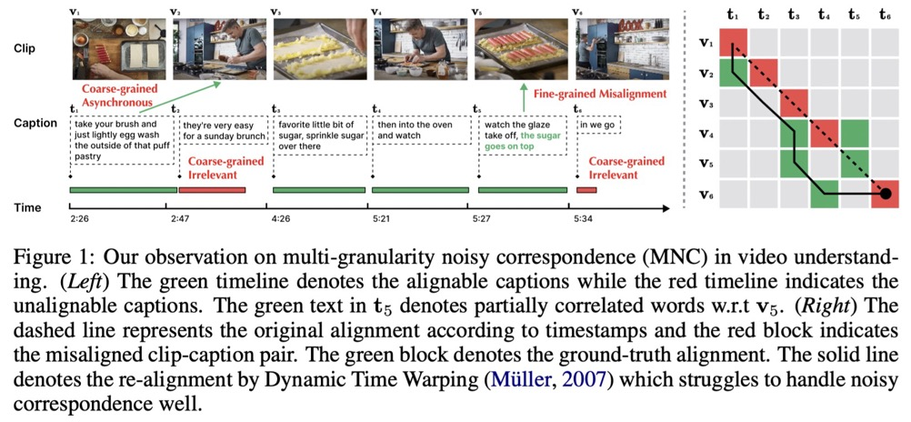
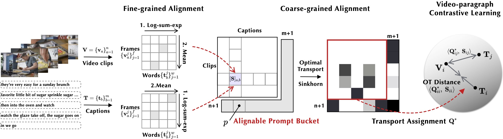

## Norton: Multi-granularity Correspondence Learning from Long-term Noisy Videos

Norton is a contrastive model for long-term video learning that enjoys zero-shot transfer to retrieval/QA/sequence labeling style tasks.
> Yijie Lin, Jie Zhang, Zhenyu Huang, Jia Liu, Zujie Wen, Xi Peng, Multi-granularity Correspondence Learning from Long-term Noisy Videos, ICLR 2024 (oral).  [[paper]](https://arxiv.org/pdf/2401.16702.pdf) 

Project page: [https://lin-yijie.github.io/projects/Norton/](https://lin-yijie.github.io/projects/Norton/).

### Background

Existing video-language studies mainly focus on learning short video clips, leaving **long-term temporal dependencies** rarely explored due to over-high computational cost of modeling long videos. To address this issue, one feasible solution is learning the correspondence between video clips and captions, which inevitably encounters the multi-granularity noisy correspondence (MNC) problem as shown in Fig. 1. To be specific, MNC refers to the clip-caption misalignment (coarse-grained) and frame-word misalignment (fine-grained), hindering temporal learning and video understanding. In this paper, we propose NOise Robust Temporal Optimal traNsport (Norton) that addresses MNC in a unified optimal transport (OT) framework. 

### Method

We perform video-paragraph contrastive learning to capture long-term temporal correlations from a fine-to-coarse perspective. Specifically, we first utilize the log-sum-exp operator on the frame-word similarity matrix to obtain fine-grained similarity between clip and caption. Additionally, we append an alignable prompt bucket on the clip-caption similarity matrix to filter out the irrelevant clips or captions. By applying Sinkhorn iterations on the clip-caption similarity matrix, we effectively tackle the asynchronous problem and obtain the optimal transport distance as the video-paragraph similarity.

### News
- [2023-1-16] Norton is accepted to ICLR 2024 as oral presentation.

### Todo
- [ ] Release Norton checkpoint.
- [ ] Release pre-training data (30 fps S3D).
- [ ] Release downstream data.
- [ ] Release the code (we have prepared the code and under review by Ant Group).

